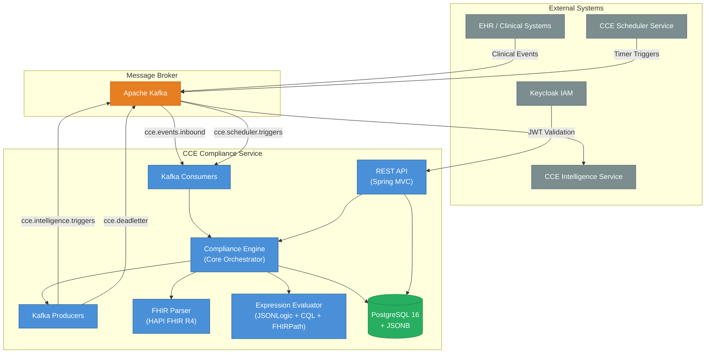
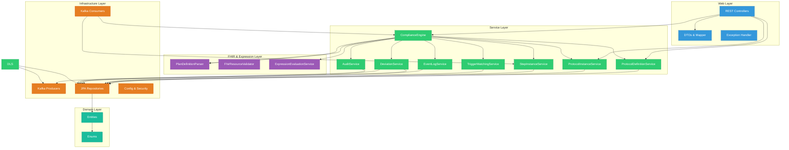

# Architecture Overview

## 1. System Context

The **CCE Compliance Service** is a core microservice within the **Clinical Compliance Engine (CCE)** platform. It is responsible for tracking patient adherence to clinical protocols defined as FHIR R4 `PlanDefinition` resources. The service consumes clinical events, matches them against protocol steps, detects deviations, and publishes intelligence triggers for downstream analytics.

## 2. Component Architecture

The service follows a **layered architecture** with clear separation of concerns:

## 3. Technology Stack

| Category | Technology | Version | Purpose |
|---|---|---|---|
| **Runtime** | Java | 21 LTS | Language runtime with virtual threads support |
| **Framework** | Spring Boot | 3.4.2 | Application framework |
| **Web** | Spring MVC | 6.x | REST API layer |
| **Persistence** | Spring Data JPA / Hibernate | 6.x | ORM and data access |
| **Database** | PostgreSQL | 16 | Primary data store with JSONB, GIN indexes, table partitioning |
| **Migration** | Flyway | 10.x | Schema version management |
| **JSONB Mapping** | Hypersistence Utils | 3.7.3 | JPA ↔ PostgreSQL JSONB mapping |
| **Messaging** | Spring Kafka | 3.x | Event-driven messaging |
| **FHIR** | HAPI FHIR | 7.4.0 | HL7 FHIR R4 PlanDefinition parsing & validation |
| **Expression Engine** | json-logic-java | 1.0.7 | Tier 2 conditional evaluation (JSONLogic) |
| **CQL Engine** | CQF CQL Engine | 3.26.0 | Tier 2 Clinical Quality Language evaluation |
| **FHIRPath Cache** | HAPI FHIR Caching (Caffeine) | 7.4.0 | Cache service provider for FHIRPath engine |
| **Security** | Spring Security OAuth2 | 6.x | JWT-based authentication (Keycloak) |
| **Resilience** | Resilience4j | 2.2.0 | Circuit breakers, retry patterns |
| **Metrics** | Micrometer + Prometheus | 1.x | Application metrics and monitoring |
| **Tracing** | OpenTelemetry | 1.x | Distributed tracing |
| **Containerization** | Docker | — | Multi-stage build, Alpine-based runtime |
| **Testing** | Testcontainers | 1.x | Integration testing with real PostgreSQL & Kafka |

## 4. Key Design Decisions

### 4.1 FHIR R4 PlanDefinition as Protocol Schema

Clinical protocols are defined using the HL7 FHIR R4 `PlanDefinition` resource. This provides:
- **Standardized structure** for actions, triggers, conditions, and timing
- **Interoperability** with external clinical systems
- **Rich metadata** including code filters, data requirements, and related actions

### 4.2 Two-Tier Trigger Matching

The service uses a **two-tier matching algorithm** for matching inbound events to protocol steps:

| Tier | Name | Mechanism | Purpose |
|---|---|---|---|
| **Tier 1** | Structural Match | Inverted index lookup (trigger_index table) | Fast O(1) filtering by resource type + code |
| **Tier 2** | Condition Evaluation | JSONLogic, CQL, or FHIRPath expression evaluation | Rich conditional logic on event/patient/step context |

### 4.3 Event Sourcing via Event Log

All inbound clinical events are persisted in a **monthly-partitioned** `event_log` table before processing. This provides:
- **Idempotency** via `(cloudeventsId, source)` uniqueness
- **Audit trail** for compliance verification
- **Replayability** for debugging and reprocessing

### 4.4 CloudEvents Envelope

All Kafka messages follow the **CloudEvents v1.0 specification** with CCE-specific extension attributes, ensuring consistent event metadata across the platform.

### 4.5 Dead Letter Queue Pattern

Failed events are captured in a persistent dead-letter store with **exponential backoff retry** (5, 10, 20, 40, 80 minutes), ensuring no data loss and enabling operational recovery.

## 5. Cross-Cutting Concerns

| Concern | Implementation |
|---|---|
| **Authentication** | OAuth2 JWT validation via Keycloak |
| **Authorization** | Scope-based: `compliance:read`, `compliance:write` |
| **Observability** | Micrometer metrics, OpenTelemetry tracing, structured logging with correlationId |
| **Audit** | Async, separate-transaction audit logging for all state changes |
| **Error Handling** | Global exception handler with structured error responses |
| **Idempotency** | CloudEvents ID + source deduplication |
| **Resilience** | Dead letter queue, exponential backoff, circuit breakers |
