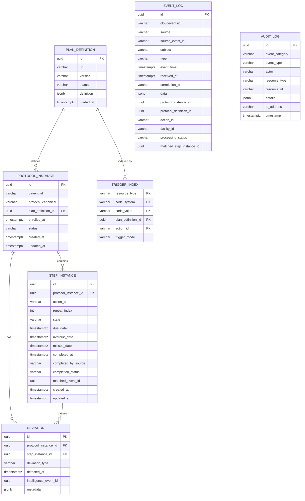

# Data Model

## 1. Entity Relationship Diagram



## 2. Table Details

### 2.1 plan_definition

Stores FHIR R4 PlanDefinition resources representing clinical protocols.

| Column | Type | Constraints | Description |
|---|---|---|---|
| `id` | `UUID` | PK, default `gen_random_uuid()` | Unique identifier |
| `url` | `VARCHAR(500)` | NOT NULL | FHIR canonical URL (e.g., `http://example.org/PlanDefinition/hiv-treatment`) |
| `version` | `VARCHAR(50)` | NOT NULL | Semantic version (e.g., `1.0`) |
| `status` | `VARCHAR(20)` | NOT NULL, default `'active'` | `active` or `retired` |
| `definition` | `JSONB` | NOT NULL | Full FHIR PlanDefinition resource as JSON |
| `loaded_at` | `TIMESTAMPTZ` | NOT NULL, default `NOW()` | When the definition was loaded |

**Constraints:**
- `UNIQUE(url, version)` — prevents duplicate definitions

**Indexes:**

| Index | Type | Columns | Purpose |
|---|---|---|---|
| `idx_plan_def_url_version` | UNIQUE B-tree | `(url, version)` | Fast lookup by canonical identity |
| `idx_plan_def_status` | B-tree | `status` | Filter by active/retired |
| `idx_plan_def_definition` | GIN | `definition` | JSONB containment queries |

---

### 2.2 protocol_instance

Tracks patient enrollment in clinical protocols.

| Column | Type | Constraints | Description |
|---|---|---|---|
| `id` | `UUID` | PK | Unique identifier |
| `patient_id` | `VARCHAR(100)` | NOT NULL | Patient identifier from clinical system |
| `protocol_canonical` | `VARCHAR(550)` | NOT NULL | `url\|version` reference |
| `plan_definition_id` | `UUID` | FK → plan_definition(id), NOT NULL | Link to PlanDefinition |
| `enrolled_at` | `TIMESTAMPTZ` | NOT NULL | Enrollment timestamp |
| `status` | `VARCHAR(20)` | NOT NULL, default `'active'` | `active`, `completed`, `withdrawn`, `expired` |
| `created_at` | `TIMESTAMPTZ` | NOT NULL | Record creation |
| `updated_at` | `TIMESTAMPTZ` | NOT NULL | Last modification |

**Indexes:**

| Index | Type | Columns | Purpose |
|---|---|---|---|
| `idx_protocol_instance_patient` | B-tree | `patient_id` | Patient lookup |
| `idx_protocol_instance_status` | B-tree | `status` | Status filtering |
| `idx_protocol_instance_active` | Partial B-tree | `patient_id, plan_definition_id WHERE status = 'active'` | Fast active enrollment check |

---

### 2.3 step_instance

Tracks individual steps within a protocol enrollment.

| Column | Type | Constraints | Description |
|---|---|---|---|
| `id` | `UUID` | PK | Unique identifier |
| `protocol_instance_id` | `UUID` | FK → protocol_instance(id), NOT NULL | Parent protocol |
| `action_id` | `VARCHAR(200)` | NOT NULL | PlanDefinition action ID |
| `repeat_index` | `INTEGER` | NOT NULL, default 0 | 0-based repeat counter for recurring actions |
| `state` | `VARCHAR(20)` | NOT NULL, default `'pending'` | `pending`, `due`, `overdue`, `missed`, `completed`, `skipped` |
| `due_date` | `TIMESTAMPTZ` | | When step becomes due |
| `overdue_date` | `TIMESTAMPTZ` | | When step is overdue |
| `missed_date` | `TIMESTAMPTZ` | | When step is considered missed |
| `completed_at` | `TIMESTAMPTZ` | | Completion timestamp |
| `completed_by_source` | `VARCHAR(200)` | | Source system that completed the step |
| `completion_status` | `VARCHAR(20)` | | `on_time`, `early`, `late` |
| `matched_event_id` | `UUID` | | EventLog ID that triggered completion |
| `created_at` | `TIMESTAMPTZ` | NOT NULL | Record creation |
| `updated_at` | `TIMESTAMPTZ` | NOT NULL | Last modification |

**Indexes:**

| Index | Type | Columns | Purpose |
|---|---|---|---|
| `idx_step_instance_protocol` | B-tree | `protocol_instance_id` | Steps for a protocol |
| `idx_step_active_states` | Partial B-tree | `protocol_instance_id, action_id WHERE state IN ('pending', 'due', 'overdue')` | Active step lookup |
| `idx_step_due_date` | Partial B-tree | `due_date WHERE state = 'pending'` | Scheduler query for upcoming steps |

---

### 2.4 deviation

Records adherence deviations detected by the compliance engine.

| Column | Type | Constraints | Description |
|---|---|---|---|
| `id` | `UUID` | PK | Unique identifier |
| `protocol_instance_id` | `UUID` | FK → protocol_instance(id), NOT NULL | Parent protocol |
| `step_instance_id` | `UUID` | FK → step_instance(id) | Associated step (nullable for protocol-level deviations) |
| `deviation_type` | `VARCHAR(30)` | NOT NULL | `overdue`, `missed`, `ambiguous` |
| `detected_at` | `TIMESTAMPTZ` | NOT NULL, default `NOW()` | Detection timestamp |
| `intelligence_event_id` | `UUID` | | ID of published IntelligenceTriggerEvent |
| `metadata` | `JSONB` | | Additional context information |

**Indexes:**

| Index | Type | Columns | Purpose |
|---|---|---|---|
| `idx_deviation_protocol` | B-tree | `protocol_instance_id` | Deviations per protocol |
| `idx_deviation_type` | B-tree | `deviation_type` | Filter by type |

---

### 2.5 trigger_index

Inverted index for fast Tier 1 structural matching of events to PlanDefinition actions.

| Column | Type | Constraints | Description |
|---|---|---|---|
| `resource_type` | `VARCHAR(100)` | PK (composite) | FHIR resource type (e.g., `Observation`) |
| `code_system` | `VARCHAR(500)` | PK (composite) | Coding system URI (e.g., `http://loinc.org`). NULL = wildcard |
| `code_value` | `VARCHAR(100)` | PK (composite) | Code value (e.g., `25836-8`). NULL = wildcard |
| `plan_definition_id` | `UUID` | PK (composite), FK → plan_definition(id) | Source PlanDefinition |
| `action_id` | `VARCHAR(200)` | PK (composite) | PlanDefinition action ID |
| `trigger_mode` | `VARCHAR(30)` | NOT NULL | `data-added` or `named-event` |

**Composite Primary Key:** `(resource_type, code_system, code_value, plan_definition_id, action_id)`

**Key Query Pattern:**
```sql
SELECT * FROM trigger_index
WHERE resource_type = ?
  AND (
    (code_system = ? AND code_value = ?)
    OR code_system IS NULL
  )
```

---

### 2.6 event_log (Partitioned)

Stores all inbound clinical events for auditability and idempotency. **Monthly-partitioned** by `received_at`.

| Column | Type | Constraints | Description |
|---|---|---|---|
| `id` | `UUID` | PK | Unique identifier |
| `cloudeventsid` | `VARCHAR(200)` | NOT NULL | CloudEvents ID |
| `source` | `VARCHAR(500)` | NOT NULL | Event source URI |
| `source_event_id` | `VARCHAR(200)` | | Original event ID from source |
| `subject` | `VARCHAR(200)` | | Event subject (typically patientId) |
| `type` | `VARCHAR(200)` | NOT NULL | Event type (e.g., `cce.observation.created`) |
| `event_time` | `TIMESTAMPTZ` | | Original event timestamp |
| `received_at` | `TIMESTAMPTZ` | NOT NULL, default `NOW()` | **Partition key** |
| `correlation_id` | `VARCHAR(200)` | | Distributed trace correlation |
| `data` | `JSONB` | | Event payload |
| `protocol_instance_id` | `UUID` | | Matched protocol instance |
| `protocol_definition_id` | `UUID` | | Matched protocol definition |
| `action_id` | `VARCHAR(200)` | | Matched action ID |
| `facility_id` | `VARCHAR(100)` | | Facility identifier |
| `processing_status` | `VARCHAR(20)` | NOT NULL, default `'zero_match'` | `matched`, `zero_match`, `ambiguous`, `duplicate` |
| `matched_step_instance_id` | `UUID` | | Step completed by this event |

**Constraints:**
- `UNIQUE(cloudeventsid, source)` — idempotency guarantee

**Partitions:**

```sql
CREATE TABLE event_log (...)
PARTITION BY RANGE (received_at);

CREATE TABLE event_log_2026_02 PARTITION OF event_log
    FOR VALUES FROM ('2026-02-01') TO ('2026-03-01');
-- ... monthly partitions through 2026-06
```

**Indexes (per partition):**

| Index | Type | Columns | Purpose |
|---|---|---|---|
| `idx_event_log_cloudevents` | UNIQUE B-tree | `(cloudeventsid, source)` | Idempotency check |
| `idx_event_log_subject` | B-tree | `subject` | Patient event lookup |
| `idx_event_log_facility` | B-tree | `facility_id` | Facility-based queries |

---

### 2.7 audit_log

Immutable audit trail for all significant operations.

| Column | Type | Constraints | Description |
|---|---|---|---|
| `id` | `UUID` | PK | Unique identifier |
| `event_category` | `VARCHAR(100)` | NOT NULL | Category (e.g., `protocol.definition`, `step.instance`) |
| `event_type` | `VARCHAR(100)` | NOT NULL | Type (e.g., `loaded`, `completed`, `matched`) |
| `actor` | `VARCHAR(200)` | NOT NULL | Who performed the action (`system` for automated) |
| `resource_type` | `VARCHAR(100)` | | Target resource type |
| `resource_id` | `VARCHAR(200)` | | Target resource ID |
| `details` | `JSONB` | | Additional structured details |
| `ip_address` | `VARCHAR(50)` | | Client IP (API calls only) |
| `timestamp` | `TIMESTAMPTZ` | NOT NULL, default `NOW()` | When the action occurred |

**Indexes:**

| Index | Type | Columns | Purpose |
|---|---|---|---|
| `idx_audit_log_category` | B-tree | `event_category` | Category filtering |
| `idx_audit_log_actor` | B-tree | `actor` | Actor-based queries |
| `idx_audit_log_timestamp` | B-tree | `timestamp` | Time-range queries |

---

## 3. JSONB Column Details

### 3.1 plan_definition.definition

Contains the complete FHIR R4 PlanDefinition resource:

```json
{
  "resourceType": "PlanDefinition",
  "url": "http://example.org/PlanDefinition/hiv-treatment",
  "version": "1.0",
  "status": "active",
  "action": [
    {
      "id": "viral-load-check",
      "trigger": [
        {
          "type": "data-added",
          "data": [
            {
              "type": "Observation",
              "codeFilter": [
                {
                  "path": "code",
                  "code": [
                    { "system": "http://loinc.org", "code": "25836-8" }
                  ]
                }
              ]
            }
          ]
        }
      ],
      "condition": [
        {
          "kind": "applicability",
          "expression": {
            "language": "text/jsonlogic",
            "expression": "{\">=\": [{\"var\": \"event.valueQuantity.value\"}, 1000]}"
          }
        }
      ]
    }
  ]
}
```

### 3.2 event_log.data

Contains the clinical event payload (FHIR-like structure):

```json
{
  "resourceType": "Observation",
  "code": {
    "coding": [
      {
        "system": "http://loinc.org",
        "code": "25836-8",
        "display": "HIV-1 RNA"
      }
    ]
  },
  "valueQuantity": {
    "value": 1500,
    "unit": "copies/mL"
  },
  "subject": {
    "reference": "Patient/patient-12345"
  }
}
```

### 3.3 deviation.metadata

Context-specific metadata:

```json
{
  "matchedPlanDefinitions": ["plan-def-id-1", "plan-def-id-2"],
  "matchedActionIds": ["action-1", "action-2"],
  "eventType": "cce.observation.created",
  "resourceType": "Observation"
}
```

---

## 4. JPA ↔ PostgreSQL Mapping

### 4.1 JSONB Mapping

All JSONB columns use **Hypersistence Utils** for transparent JPA mapping:

```java
@Type(JsonType.class)
@Column(name = "definition", columnDefinition = "jsonb")
private Map<String, Object> definition;
```

This maps Java `Map<String, Object>` ↔ PostgreSQL `JSONB` with automatic serialization/deserialization.

### 4.2 Enum Mapping

All enums use `@Enumerated(EnumType.STRING)` with lowercase values stored in the database:

```java
@Enumerated(EnumType.STRING)
@Column(name = "status")
private PlanDefinitionStatus status;  // stores "active" or "retired"
```

### 4.3 Composite Primary Key

`TriggerIndex` uses `@IdClass(TriggerIndexId.class)`:

```java
@IdClass(TriggerIndex.TriggerIndexId.class)
@Entity
public class TriggerIndex {
    @Id private String resourceType;
    @Id private String codeSystem;
    @Id private String codeValue;
    @Id private UUID planDefinitionId;
    @Id private String actionId;

    public static class TriggerIndexId implements Serializable {
        // All @Id fields + equals() + hashCode()
    }
}
```

---

## 5. Partitioning Management

### 5.1 Adding New Partitions

New monthly partitions must be created before data arrives:

```sql
-- Add partition for July 2026
CREATE TABLE event_log_2026_07 PARTITION OF event_log
    FOR VALUES FROM ('2026-07-01') TO ('2026-08-01');
```

### 5.2 Archiving Old Partitions

Old partitions can be detached and archived:

```sql
-- Detach February 2026 partition
ALTER TABLE event_log DETACH PARTITION event_log_2026_02;

-- Optional: move to archive schema
ALTER TABLE event_log_2026_02 SET SCHEMA archive;
```

### 5.3 Current Partitions

| Partition | Range |
|---|---|
| `event_log_2026_02` | 2026-02-01 to 2026-03-01 |
| `event_log_2026_03` | 2026-03-01 to 2026-04-01 |
| `event_log_2026_04` | 2026-04-01 to 2026-05-01 |
| `event_log_2026_05` | 2026-05-01 to 2026-06-01 |
| `event_log_2026_06` | 2026-06-01 to 2026-07-01 |
