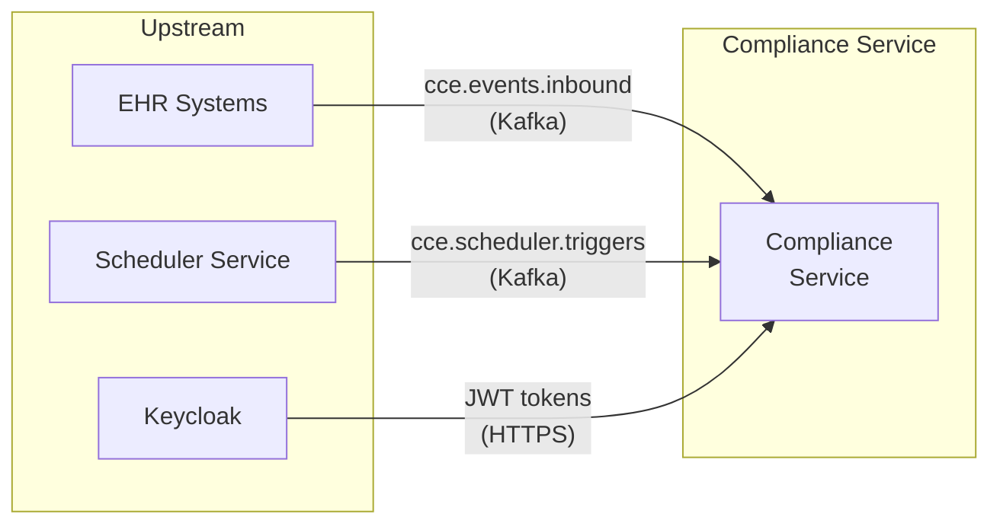
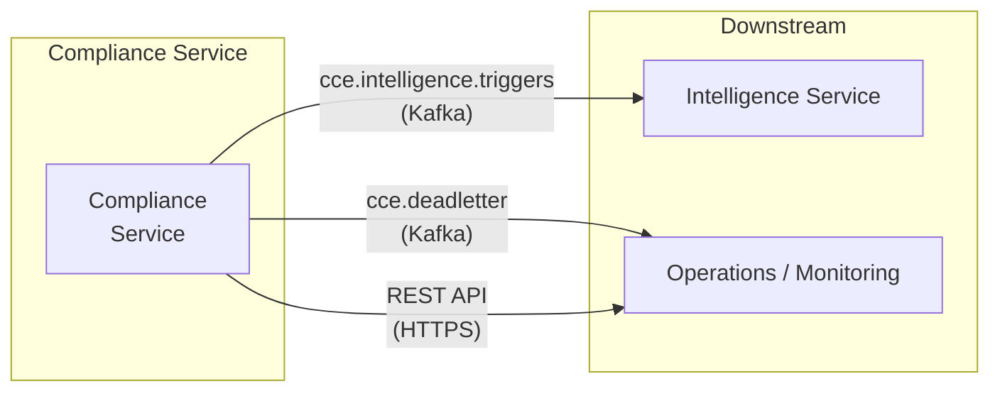
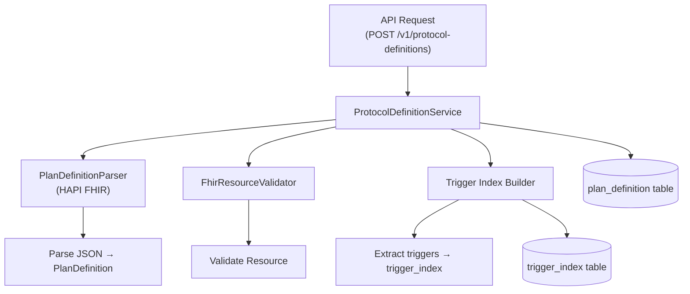
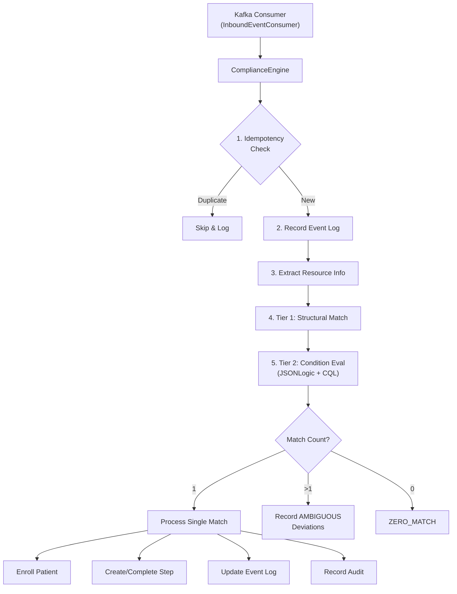
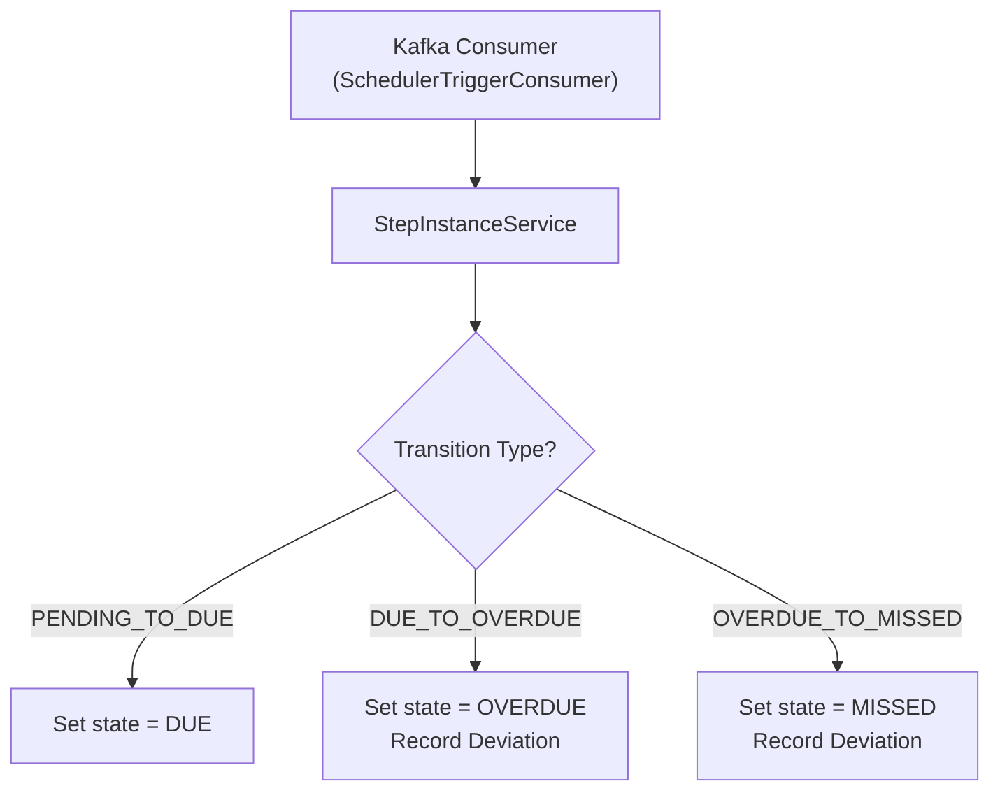
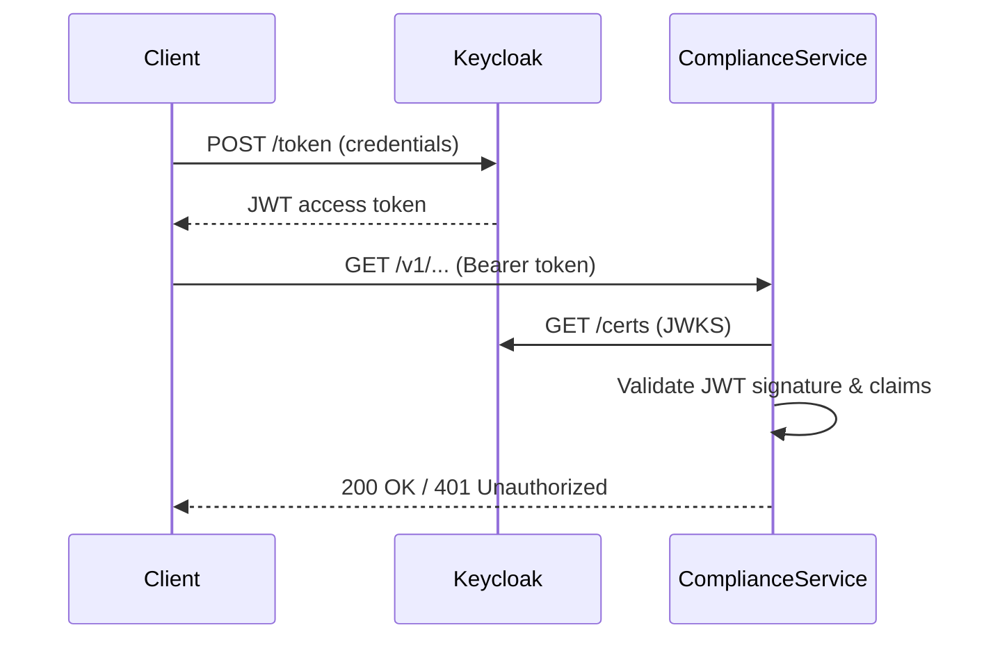

# High-Level Design (HLD)

## 1. Introduction

### 1.1 Purpose

The CCE Compliance Service is responsible for:
1. **Loading** clinical protocols defined as FHIR R4 PlanDefinition resources
2. **Tracking** patient enrollment and step-level adherence to loaded protocols
3. **Matching** inbound clinical events to protocol steps using a two-tier algorithm
4. **Detecting** deviations (overdue, missed, ambiguous) in patient adherence
5. **Publishing** intelligence triggers for downstream analytics and alerting

### 1.2 Scope

This service is one component within the broader CCE platform. It does **not** handle:
- Event generation (EHR/clinical systems produce events)
- Scheduling (the CCE Scheduler Service manages timers)
- Analytics/alerting (the CCE Intelligence Service consumes triggers)
- User authentication (Keycloak handles identity)

## 2. System Interactions

### 2.1 Upstream Dependencies



| Dependency | Protocol | Topic/Endpoint | Purpose |
|---|---|---|---|
| EHR / Clinical Systems | Kafka | `cce.events.inbound` | Inbound clinical events (observations, encounters, procedures) |
| CCE Scheduler Service | Kafka | `cce.scheduler.triggers` | Timer-based state transitions (PENDING→DUE→OVERDUE→MISSED) |
| Keycloak | HTTPS | JWKS endpoint | JWT token validation and scope verification |

### 2.2 Downstream Dependencies



| Dependency | Protocol | Topic/Endpoint | Purpose |
|---|---|---|---|
| CCE Intelligence Service | Kafka | `cce.intelligence.triggers` | Deviation alerts and compliance events |
| Dead Letter consumers | Kafka | `cce.deadletter` | Failed event notifications for operational recovery |
| API consumers | HTTPS | `/v1/*` endpoints | Protocol management and patient tracking queries |

### 2.3 Infrastructure Dependencies

| Component | Purpose | Configuration |
|---|---|---|
| PostgreSQL 16 | Primary data store | `DB_HOST`, `DB_PORT`, `DB_NAME`, `DB_USERNAME`, `DB_PASSWORD` |
| Apache Kafka | Event streaming | `KAFKA_BOOTSTRAP_SERVERS` |
| Keycloak | Identity provider | `KEYCLOAK_ISSUER_URI`, `KEYCLOAK_JWK_SET_URI` |

## 3. Subsystem Decomposition

### 3.1 Protocol Management Subsystem

Handles loading, validating, and retiring FHIR PlanDefinition resources.



**Responsibilities:**
- Parse and validate FHIR JSON into `PlanDefinition` resources
- Store the definition with its JSONB representation
- Build an inverted **trigger index** mapping `(resourceType, codeSystem, codeValue)` → `(planDefinitionId, actionId)` for fast Tier 1 matching
- Support retirement (soft-delete) and index rebuilding

### 3.2 Event Processing Subsystem

The core pipeline that processes inbound clinical events.



**Responsibilities:**
- Consume CloudEvents from `cce.events.inbound`
- Perform idempotency check via `(cloudeventsId, source)`
- Execute two-tier trigger matching (Tier 1 structural + Tier 2 expression evaluation via JSONLogic or CQL)
- Enroll patients in protocols automatically on first match
- Create and complete step instances
- Detect and record deviations

### 3.3 Scheduler Integration Subsystem

Handles timer-based state transitions for protocol steps.



**Responsibilities:**
- Consume timer triggers from `cce.scheduler.triggers`
- Apply state transitions with guard checks (e.g., only transition if current state matches expected state)
- Record deviations for OVERDUE and MISSED transitions

### 3.4 Intelligence Publishing Subsystem

Publishes compliance events to the Intelligence Service.

**Responsibilities:**
- Wrap deviation data in `IntelligenceTriggerEvent` messages
- Publish to `cce.intelligence.triggers` topic
- Include context: protocol, step, patient, facility, deviation type

### 3.5 Dead Letter Subsystem

Handles failed event processing with retry logic.

**Responsibilities:**
- Capture failed events with failure reason and stage
- Implement exponential backoff retry (5 min base, max 5 retries)
- Publish to `cce.deadletter` topic for operational visibility
- Support manual resolution via service methods

## 4. Security Model

### 4.1 Authentication



- **Protocol:** OAuth 2.0 with JWT Bearer tokens
- **Provider:** Keycloak (`cce-production` realm)
- **Validation:** JWK Set URI for public key retrieval

### 4.2 Authorization

| Endpoint Pattern | Required Scope | Description |
|---|---|---|
| `GET /actuator/**` | None (permitAll) | Health checks, metrics |
| `POST /v1/protocol-definitions/**` | `compliance:write` | Load/retire PlanDefinitions |
| `GET /v1/**` | `compliance:read` | Query protocols, instances, events |
| All other endpoints | Authenticated | Catch-all requires valid JWT |

### 4.3 Session Management

- **Stateless** — no server-side sessions
- **CSRF disabled** — not applicable for API-only service
- JWT claims provide identity context per request

## 5. Data Architecture

### 5.1 Storage Strategy

| Data Type | Storage | Rationale |
|---|---|---|
| Structured data (IDs, timestamps, status) | PostgreSQL columns | Efficient querying, indexing, constraints |
| Semi-structured data (FHIR definitions, event payloads) | PostgreSQL JSONB | Flexible schema, GIN indexes, in-DB querying |
| Event stream | Apache Kafka | Decoupled async processing, replay capability |

### 5.2 Partitioning Strategy

The `event_log` table uses **monthly range partitioning** on `received_at` to manage data growth:

```
event_log (parent)
├── event_log_2026_02 (Feb 2026)
├── event_log_2026_03 (Mar 2026)
├── event_log_2026_04 (Apr 2026)
├── event_log_2026_05 (May 2026)
└── event_log_2026_06 (Jun 2026)
```

**Benefits:** Efficient partition pruning for time-range queries, easy archival of old partitions, reduced index bloat.

### 5.3 Connection Pooling

HikariCP with:
- **Max pool size:** 20 connections
- **Min idle:** 5 connections
- **Connection timeout:** 30 seconds
- **Idle timeout:** 10 minutes
- **Max lifetime:** 30 minutes

## 6. Observability

### 6.1 Metrics (Prometheus)

| Metric | Type | Description |
|---|---|---|
| `cce.events.processed` | Counter | Total inbound events processed |
| `cce.events.matched` | Counter (tagged) | Events by match status: `matched`, `zero_match`, `ambiguous` |
| `cce.events.duplicate` | Counter | Duplicate events detected |
| `cce.step.matching.duration` | Timer | Time spent in trigger matching pipeline |
| `cce.protocol.instances.active` | Gauge | Count of active protocol instances |
| `cce.dead_letter.unresolved` | Gauge | Count of unresolved dead letter events |
| `http.server.requests` | Histogram | HTTP request latency with percentiles |

### 6.2 Distributed Tracing

- **Protocol:** OpenTelemetry (OTLP exporter)
- **Sampling:** 100% (configurable via `management.tracing.sampling.probability`)
- **Correlation:** `correlationId` propagated via MDC and CloudEvents extensions

### 6.3 Structured Logging

```
2026-03-15 10:30:00.123 [kafka-consumer-1] [corr-abc123] INFO ComplianceEngine - Processing event...
```

Pattern: `timestamp [thread] [correlationId] level logger - message`

### 6.4 Health Checks

| Endpoint | Purpose |
|---|---|
| `/actuator/health` | Overall health (DB, Kafka, disk) |
| `/actuator/health/liveness` | Kubernetes liveness probe |
| `/actuator/health/readiness` | Kubernetes readiness probe |
| `/actuator/prometheus` | Prometheus metrics scrape endpoint |
| `/actuator/info` | Application info |

## 7. Deployment Architecture

### 7.1 Container Image

```dockerfile
# Multi-stage build
Build:  eclipse-temurin:21-jdk-alpine
Runtime: eclipse-temurin:21-jre-alpine

# JVM Configuration
-XX:+UseContainerSupport
-XX:MaxRAMPercentage=75.0
-XX:+UseG1GC

# Security
Runs as non-root user 'cce' (UID 1001)
```

### 7.2 Scaling Considerations

| Dimension | Strategy |
|---|---|
| **Horizontal** | Kafka consumer group enables multi-instance deployment; partition assignment is automatic |
| **Database** | Connection pool per instance (20 max); event_log partitioned for read scalability |
| **Kafka concurrency** | 3 concurrent listener threads per instance |
| **Stateless API** | Any instance can serve any request |

## 8. Error Handling Strategy

### 8.1 Error Classification

| Error Type | HTTP Status | Recovery |
|---|---|---|
| Resource not found | 404 | Client retries with correct ID |
| Invalid input | 400 | Client fixes request |
| State conflict | 409 | Client resolves conflict |
| FHIR validation failure | 422 | Client fixes FHIR resource |
| Expression evaluation error | 422 | Admin fixes expression |
| Internal error | 500 | Dead-lettered for retry |

### 8.2 Kafka Error Handling

- **Consumer errors:** Event is NOT acknowledged → Kafka redelivers
- **Processing errors:** Event is dead-lettered (DB + Kafka topic)
- **Producer errors:** Idempotent producer with `acks=all` and 3 retries
- **Deserialization errors:** `ErrorHandlingDeserializer` wraps errors gracefully
