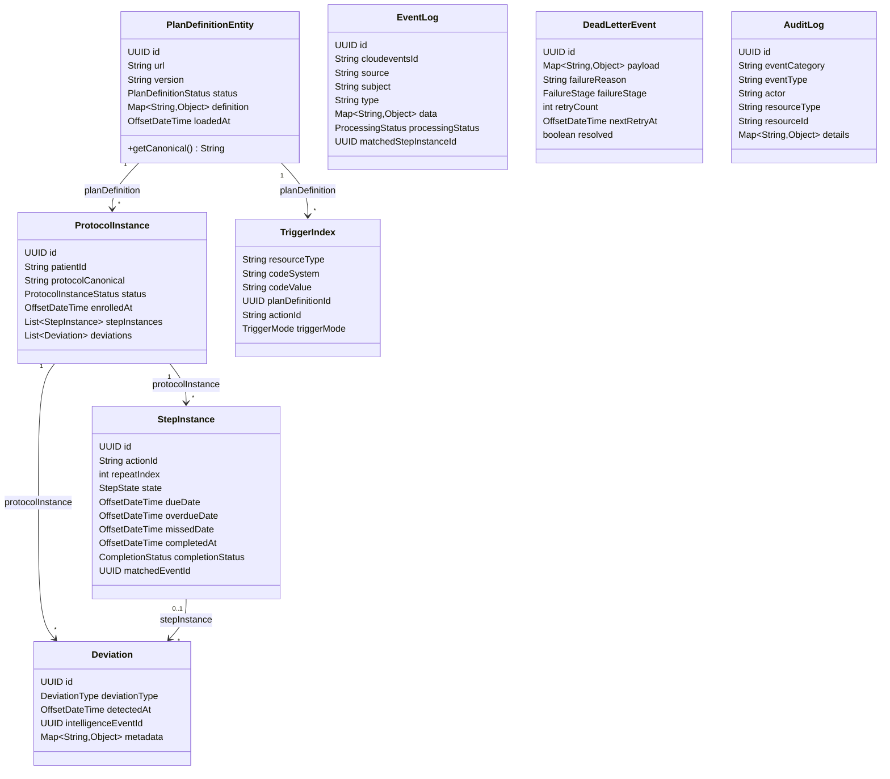
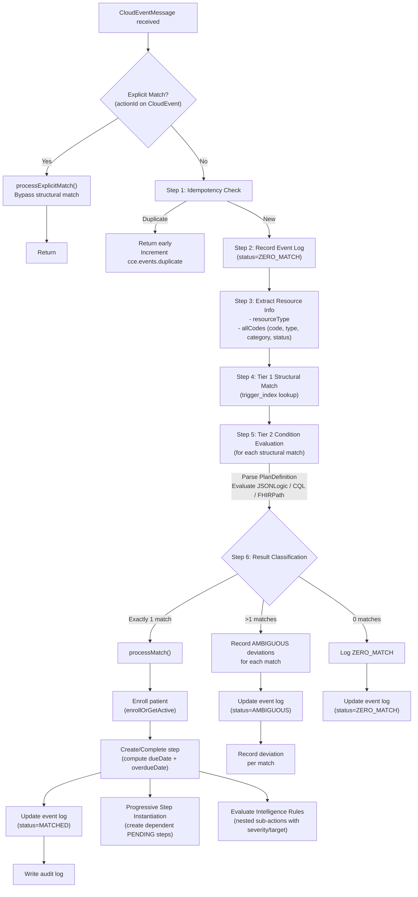
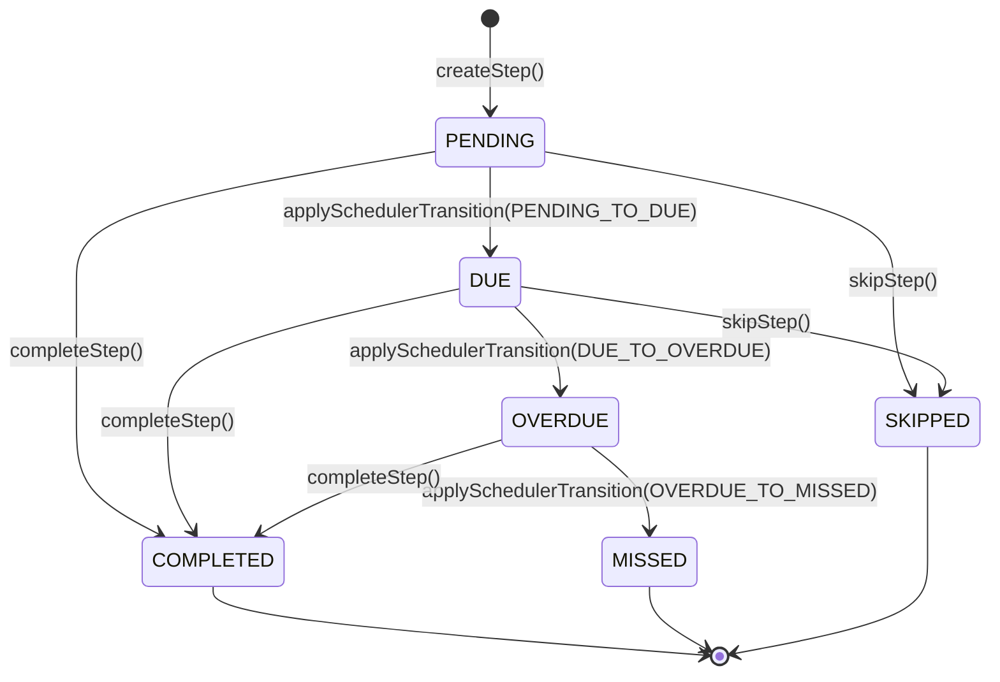
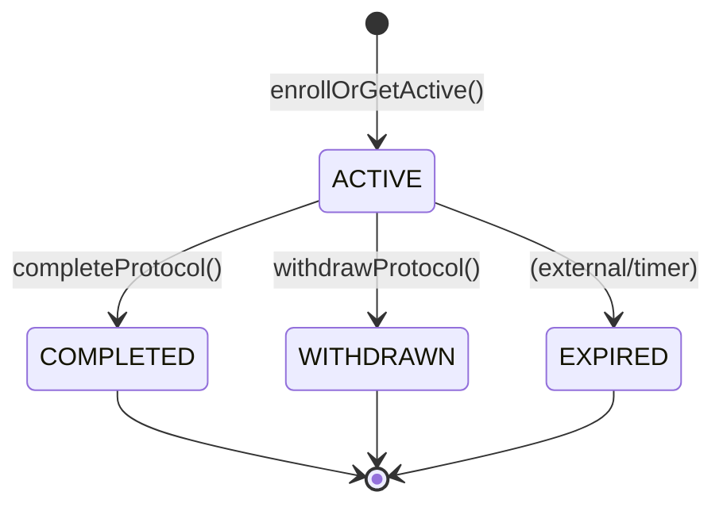
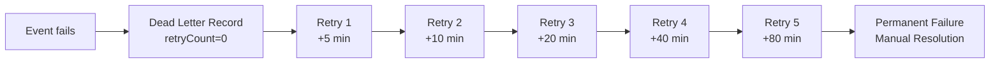

# Low-Level Design (LLD)

## 1. Package Structure

```
org.openphc.cce.compliance
├── ComplianceServiceApplication.java          # @SpringBootApplication entry point
│
├── config/
│   ├── AppConfig.java                         # ObjectMapper, @EnableAsync
│   ├── ObservabilityConfig.java               # Micrometer gauges & common tags
│   └── SecurityConfig.java                    # OAuth2 JWT, scope-based ACL
│
├── domain/
│   ├── entity/                                # JPA entities (8 classes)
│   │   ├── AuditLog.java
│   │   ├── DeadLetterEvent.java
│   │   ├── Deviation.java
│   │   ├── EventLog.java
│   │   ├── PlanDefinitionEntity.java
│   │   ├── ProtocolInstance.java
│   │   ├── StepInstance.java
│   │   └── TriggerIndex.java                  # Composite PK via TriggerIndexId
│   ├── enums/                                 # Value-based enums (8 classes)
│   │   ├── CompletionStatus.java
│   │   ├── DeviationType.java
│   │   ├── FailureStage.java
│   │   ├── PlanDefinitionStatus.java
│   │   ├── ProcessingStatus.java
│   │   ├── ProtocolInstanceStatus.java
│   │   ├── StepState.java
│   │   └── TriggerMode.java
│   └── repository/                            # Spring Data JPA repositories (8 interfaces)
│       ├── AuditLogRepository.java
│       ├── DeadLetterEventRepository.java
│       ├── DeviationRepository.java
│       ├── EventLogRepository.java
│       ├── PlanDefinitionRepository.java
│       ├── ProtocolInstanceRepository.java
│       ├── StepInstanceRepository.java
│       └── TriggerIndexRepository.java
│
├── fhir/
│   ├── CqlEvaluationEngine.java                # CQL condition evaluator (CQF Engine)
│   ├── ExpressionEvaluationService.java       # Multi-language condition evaluator
│   ├── FhirResourceValidator.java             # HAPI FHIR validation
│   ├── HapiFhirConfig.java                    # FhirContext, IParser & IFhirPath beans
│   └── PlanDefinitionParser.java              # FHIR PlanDefinition extraction
│
├── kafka/
│   ├── config/
│   │   ├── KafkaConfig.java                   # Consumer/Producer factories
│   │   └── KafkaTopicProperties.java          # Topic name bindings
│   ├── consumer/
│   │   ├── InboundEventConsumer.java           # cce.events.inbound listener
│   │   └── SchedulerTriggerConsumer.java       # cce.scheduler.triggers listener
│   ├── model/
│   │   ├── CloudEventMessage.java             # CloudEvents v1.0 envelope
│   │   ├── IntelligenceTriggerEvent.java      # Outbound deviation event
│   │   └── SchedulerTriggerMessage.java       # Inbound scheduler trigger
│   └── producer/
│       ├── DeadLetterProducer.java             # cce.deadletter publisher
│       └── IntelligenceTriggerProducer.java    # cce.intelligence.triggers publisher
│
├── service/                                   # Business logic (9 classes)
│   ├── AuditService.java
│   ├── ComplianceEngine.java                  # Central orchestrator
│   ├── DeadLetterService.java
│   ├── DeviationService.java
│   ├── EventLogService.java
│   ├── ProtocolDefinitionService.java
│   ├── ProtocolInstanceService.java
│   ├── StepInstanceService.java
│   └── TriggerMatchingService.java
│
└── web/
    ├── GlobalExceptionHandler.java            # @RestControllerAdvice
    ├── controller/
    │   ├── ProtocolDefinitionController.java  # /v1/protocol-definitions
    │   ├── ProtocolInstanceController.java    # /v1/protocol-instances
    │   └── ProtocolTrackingController.java    # /v1/patients/{id}/protocol-tracking
    ├── dto/
    │   ├── DeviationDto.java
    │   ├── ErrorResponse.java
    │   ├── EventLogDto.java
    │   ├── LoadPlanDefinitionRequest.java
    │   ├── PlanDefinitionDto.java
    │   ├── ProtocolInstanceDto.java
    │   └── StepInstanceDto.java
    └── mapper/
        └── DtoMapper.java
```

**Total: 63 source files** across 15 packages.

## 2. Class Relationships

### 2.1 Entity Relationship Diagram



### 2.2 Service Dependency Graph

```mermaid
classDiagram
    class ComplianceEngine {
        +processInboundEvent(CloudEventMessage)
        -processMatch(...)
        -processExplicitMatch(event, eventLog) boolean
        -progressiveStepInstantiation(match, protocol)
        -evaluateIntelligenceRules(match, event, protocol)
        -convertTimingOffset(value, unit) Duration
        -extractResourceType(data) String
        -extractAllCodes(event) List~CodePair~
    }

    class ProtocolDefinitionService {
        +loadPlanDefinition(String json)
        +retirePlanDefinition(url, version)
        +rebuildTriggerIndex(UUID)
        -buildTriggerIndex(entity, parsed)
    }

    class ProtocolInstanceService {
        +enrollOrGetActive(patientId, planDef)
        +completeProtocol(UUID)
        +withdrawProtocol(UUID)
    }

    class StepInstanceService {
        +createStep(protocol, actionId, dates...)
        +completeStep(UUID, UUID, String)
        +applySchedulerTransition(msg)
        +skipStep(UUID)
    }

    class TriggerMatchingService {
        +findStructuralMatches(type, system, code)
        +evaluateCondition(action, variables)
    }

    class DeviationService {
        +recordDeviation(protocol, step, type, meta)
        -publishIntelligenceTrigger(deviation)
    }

    class EventLogService {
        +isDuplicate(cloudeventsId, source)
        +recordEvent(CloudEventMessage, status)
        +updateMatchResult(...)
    }

    class AuditService {
        +audit(category, type, actor, ...)
        +auditSystem(category, type, ...)
    }

    class DeadLetterService {
        +recordDeadLetter(payload, reason, stage)
        +incrementRetry(UUID)
        +resolveDeadLetter(UUID)
    }

    ComplianceEngine --> ProtocolDefinitionService
    ComplianceEngine --> ProtocolInstanceService
    ComplianceEngine --> StepInstanceService
    ComplianceEngine --> TriggerMatchingService
    ComplianceEngine --> DeviationService
    ComplianceEngine --> EventLogService
    ComplianceEngine --> AuditService
    ComplianceEngine --> DeadLetterService
    ComplianceEngine --> PlanDefinitionParser
    ComplianceEngine --> ExpressionEvaluationService
    ExpressionEvaluationService --> CqlEvaluationEngine
    DeviationService --> IntelligenceTriggerProducer
    DeadLetterService ..> DeadLetterProducer : optional
```



## 3. ComplianceEngine — Core Pipeline

The `ComplianceEngine` is the central orchestrator (648 lines). It processes every inbound clinical event through a multi-step pipeline:

### 3.1 Pipeline Steps



### 3.2 Resource Extraction Logic

The engine extracts FHIR resource metadata from CloudEvent data using **multi-code extraction**:

| Field | Extraction Paths | Fallback |
|---|---|---|
| `resourceType` | `data.resourceType` | Parse from `event.type` (e.g., `cce.observation.created` → `Observation`) |
| `allCodes` | `data.code.coding[*]`, `data.type.coding[*]`, `data.category[*].coding[*]`, `data.clinicalStatus.coding[*]`, `data.status` | Empty list |

All codes from `code`, `type`, `category`, and `clinicalStatus` CodeableConcept fields are extracted and matched against the trigger index. This provides broader matching than single-code extraction.

### 3.3 Match Result Inner Record

```java
record MatchResult(
    PlanDefinitionEntity planDefinition,
    String actionId,
    PlanDefinition.PlanDefinitionActionComponent action
)
```

### 3.4 Metrics Instrumented

| Metric | Point of Instrumentation |
|---|---|
| `cce.events.processed` | After each event processing attempt |
| `cce.events.matched{status=matched}` | On single match |
| `cce.events.matched{status=zero_match}` | On zero matches |
| `cce.events.matched{status=ambiguous}` | On multiple matches |
| `cce.events.duplicate` | On idempotency check hit |
| `cce.step.matching.duration` | Timer around Tier 1 + Tier 2 matching |

## 4. Two-Tier Trigger Matching Algorithm

### 4.1 Tier 1 — Structural Matching (TriggerMatchingService)

**Purpose:** Fast O(1) lookup to find candidate PlanDefinition actions.

**Mechanism:** Inverted index stored in `trigger_index` table:

```sql
-- Query: find actions matching this event's resource type + code
SELECT * FROM trigger_index
WHERE resource_type = :resourceType
  AND (
    (code_system = :codeSystem AND code_value = :codeValue)
    OR code_system IS NULL  -- wildcard triggers that match any code
  )
```

**Input:** `(resourceType, codeSystem, codeValue)` extracted from event  
**Output:** `List<TriggerIndex>` — candidate plan definitions and action IDs

### 4.2 Tier 2 — Condition Evaluation (ExpressionEvaluationService)

**Purpose:** Rich conditional logic beyond structural matching.

**Mechanism:** Evaluates JSONLogic expressions against a variable context:

```json
// Example JSONLogic condition
{
  ">=": [{"var": "event.value"}, 140]
}
```

**Variable Context:**

| Variable | Source | Keys |
|---|---|---|
| `event` | CloudEvent data payload | Any fields from the clinical event |
| `patient` | Patient context (if available) | `patientId`, demographics |
| `step` | Current step context | `actionId`, `repeatIndex`, `state` |
| `protocol` | Protocol context | `protocolCanonical`, `status` |

**Supported Languages:**
- `text/jsonlogic` — evaluated via `io.github.jamsesso.jsonlogic.JsonLogic`
- `text/cql` — evaluated via CQF CQL Engine (`info.cqframework:engine:3.26.0`)
- `text/fhirpath` — evaluated via HAPI FHIR `IFhirPath` engine (R4)
- Any other language — treated as **unconditionally true** (pass-through)

### 4.3 Index Building (ProtocolDefinitionService)

When a PlanDefinition is loaded, the trigger index is built by:

1. Parsing the FHIR PlanDefinition
2. Iterating all actions (recursively, including nested sub-actions)
3. For each action, extracting triggers (`TriggerDefinition`)
4. For each trigger, extracting `DataRequirement.type` (resourceType)
5. For each trigger, extracting `DataRequirement.codeFilter.code` entries
6. Creating a `TriggerIndex` entry per `(resourceType, codeSystem, codeValue, planDefinitionId, actionId)`

## 5. State Machine — Step Instance



**Completion Status determination** (in `completeStep()`):

| Condition | CompletionStatus |
|---|---|
| `completedAt < dueDate` | `EARLY` |
| `dueDate ≤ completedAt ≤ overdueDate` | `ON_TIME` |
| `completedAt > overdueDate` OR `state == OVERDUE` | `LATE` |
| No `dueDate` set | `ON_TIME` (default) |

## 6. State Machine — Protocol Instance



## 7. Dead Letter Retry Strategy



**Formula:** `nextRetryAt = now + RETRY_DELAY_MINUTES × 2^retryCount`

| Retry | Delay | Cumulative |
|---|---|---|
| 1 | 5 min | 5 min |
| 2 | 10 min | 15 min |
| 3 | 20 min | 35 min |
| 4 | 40 min | 75 min |
| 5 | 80 min | 155 min (~2.6 hours) |

## 8. FHIR PlanDefinition Parser

The `PlanDefinitionParser` (459 lines) extracts structured data from FHIR R4 PlanDefinition resources:

### 8.0 CQL Evaluation Engine

The `CqlEvaluationEngine` (Component, ~140 lines) evaluates CQL expressions:

| Aspect | Detail |
|---|---|
| **FHIR Version** | R4 (4.0.1) |
| **Translation** | CQL → ELM via `CqlTranslator` |
| **Caching** | `ConcurrentHashMap` caches translated ELM libraries by expression key |
| **Library Wrapping** | Inline expressions are auto-wrapped in a minimal CQL library |
| **Context** | `Unfiltered` (no patient-specific data provider required) |
| **Result Expression** | Defines `"Result"` as the evaluated expression |

**Example CQL expression in a PlanDefinition condition:**
```cql
Observation.value >= 1000
```

### 8.1 Extraction Methods

| Method | Input | Output |
|---|---|---|
| `parse(String json)` | Raw FHIR JSON | `PlanDefinition` object |
| `parseFromMap(Map)` | JSONB map | `PlanDefinition` object |
| `extractAllActions(PlanDefinition)` | Parsed resource | Flat `List<PlanDefinitionActionComponent>` |
| `extractTriggers(action)` | Single action | `List<TriggerDefinition>` |
| `extractResourceType(trigger)` | Trigger definition | Resource type string (e.g., `"Observation"`) |
| `extractCodeFilters(trigger)` | Trigger definition | `List<CodeFilter>` with system + code |
| `extractConditionExpression(action)` | Action | Expression string (e.g., JSONLogic) |
| `extractConditionLanguage(action)` | Action | Language string (e.g., `"text/jsonlogic"`) |
| `extractTriggerConditionExpression(trigger)` | Trigger | Trigger-level condition expression |
| `extractTriggerConditionLanguage(trigger)` | Trigger | Trigger-level condition language |
| `findMatchingTrigger(action, resourceType, codeSystem, codeValue)` | Action + event metadata | Matching `TriggerDefinition` or `null` |
| `extractTiming(action)` | Action | `Map` with duration, frequency, period, offset |
| `extractToleranceDays(action)` | Action | `Integer` tolerance days from CCE extension (nullable) |
| `extractIntelligenceSeverity(action)` | Action | Severity string from CCE extension (e.g., `"warning"`) |
| `extractIntelligenceTarget(action)` | Action | Target string from CCE extension (e.g., `"provider"`) |
| `extractRequiredBehavior(action)` | Action | Required behavior string (e.g., `"must"`, `"could"`) |
| `extractDefinitionCanonical(action)` | Action | Canonical URL from `definitionCanonical` |
| `isIntelligenceRule(action)` | Action | `boolean` — true if action has intelligence severity extension |
| `findDependentActions(allActions, actionId)` | All actions + parent action ID | `List<Action>` that depend on the given action via `relatedAction` |
| `computeRelatedActionOffset(action, dependsOnActionId)` | Action + dependency ID | `Duration` offset from the relatedAction |

### 8.2 Action Hierarchy Flattening

PlanDefinition actions can be nested. `extractAllActions()` recursively flattens the hierarchy:

```
PlanDefinition
├── action[0]
│   ├── action[0].action[0]  (sub-action)
│   └── action[0].action[1]  (sub-action)
└── action[1]
```

Result: `[action[0], action[0].action[0], action[0].action[1], action[1]]`

## 9. Audit Trail

The `AuditService` provides an immutable audit trail:

- **Execution model:** `@Async` — audit writes don't block the main transaction
- **Transaction isolation:** `@Transactional(REQUIRES_NEW)` — audit succeeds even if main transaction rolls back
- **System events:** Convenience method `auditSystem()` uses `actor="system"` for automated actions

### 9.1 Audit Event Categories

| Category | Event Types | Trigger |
|---|---|---|
| `protocol.definition` | `loaded`, `retired`, `index_rebuilt` | PlanDefinition lifecycle |
| `protocol.instance` | `enrolled`, `completed`, `withdrawn` | Patient protocol enrollment |
| `step.instance` | `created`, `completed`, `skipped`, `state_changed` | Step lifecycle |
| `event.processing` | `matched`, `zero_match`, `ambiguous` | Event processing result |
| `deviation` | `recorded` | Deviation detection |

## 10. Repository Query Patterns

### 10.1 Custom JPQL Queries

| Repository | Method | Query Pattern |
|---|---|---|
| `ProtocolInstanceRepository` | `findActiveByPatientId` | `WHERE p.patientId = :id AND p.status = ACTIVE` |
| `ProtocolInstanceRepository` | `findActiveByPatientIdAndPlanDefinition` | `WHERE p.patientId = :id AND p.planDefinition.id = :planDefId AND p.status = ACTIVE` |
| `StepInstanceRepository` | `findActiveByProtocolInstanceAndAction` | `WHERE s.protocolInstance.id = :id AND s.actionId = :actionId AND s.state IN (PENDING, DUE, OVERDUE)` |
| `StepInstanceRepository` | `findStepsDueBy` | `WHERE s.state = PENDING AND s.dueDate <= :dateTime` |
| `StepInstanceRepository` | `findStepsOverdueBy` | `WHERE s.state = DUE AND s.overdueDate <= :dateTime` |
| `StepInstanceRepository` | `findStepsMissedBy` | `WHERE s.state = OVERDUE AND s.missedDate <= :dateTime` |
| `TriggerIndexRepository` | `findByResourceTypeAndCode` | `WHERE resourceType = :type AND (code_system = :sys AND code_value = :val OR code_system IS NULL)` |
| `DeadLetterEventRepository` | `findRetryableEvents` | `WHERE resolved = false AND nextRetryAt <= :now` |

### 10.2 Indexing Strategy

| Table | Index | Type | Columns |
|---|---|---|---|
| `plan_definition` | `idx_plan_def_url_version` | UNIQUE B-tree | `(url, version)` |
| `plan_definition` | `idx_plan_def_definition` | GIN | `definition` (JSONB) |
| `protocol_instance` | `idx_protocol_instance_patient` | B-tree | `patient_id` |
| `protocol_instance` | `idx_protocol_instance_active` | Partial B-tree | `patient_id, plan_definition_id WHERE status = 'active'` |
| `step_instance` | `idx_step_instance_protocol` | B-tree | `protocol_instance_id` |
| `step_instance` | `idx_step_active_states` | Partial B-tree | `protocol_instance_id, action_id WHERE state IN ('pending', 'due', 'overdue')` |
| `step_instance` | `idx_step_due_date` | B-tree | `due_date WHERE state = 'pending'` |
| `event_log` | `idx_event_log_cloudevents` | UNIQUE B-tree | `(cloudeventsid, source)` |
| `event_log` | `idx_event_log_subject` | B-tree | `subject` |
| `dead_letter_events` | `idx_dead_letter_unresolved` | Partial B-tree | `next_retry_at WHERE resolved = false` |
| `audit_log` | Various | B-tree | `event_category`, `actor`, `timestamp` |
